<h1 align="center">
  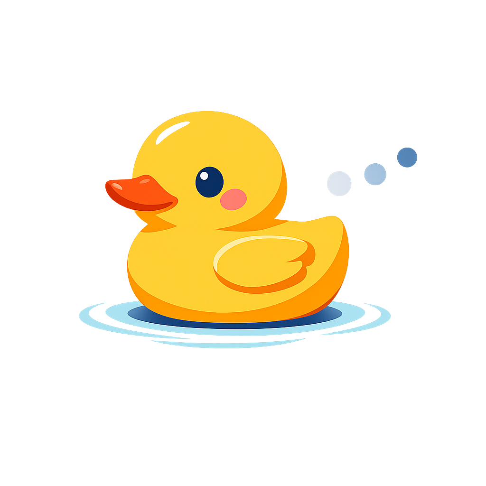
  &nbsp;dotdotduck
</h1>

<p align="center"><strong>按 Cmd/Ctrl+K，產品裡的所有事情都做得到</strong></p>

<p align="center">
  命令面板、語音、長按選取、輸入框 inline AI、DOM-grounded agent 全部包在同一個 SDK 裡。
  跟 chatbot widget 的相反 — 把產品的「動詞」放在使用者本來就在動手的地方，而不是縮在右下角的氣泡。
</p>

<p align="center">
  <a href="https://www.npmjs.com/package/@perhapxin/dddk"></a>
  <a href="https://www.npmjs.com/package/@perhapxin/dddk"></a>
  <a href="https://github.com/PerhapxinLab/dotdotduck/blob/main/LICENSE"></a>
  <a href="https://dddk.perhapxin.com/docs/v0.1.0/dddk/overview"></a>
</p>

<p align="center"><a href="./README.md">English →</a></p>

---

## 01 · 命令面板 — 所有功能，住進同一塊面板

<table>
<tr>
<td width="55%" valign="top">
  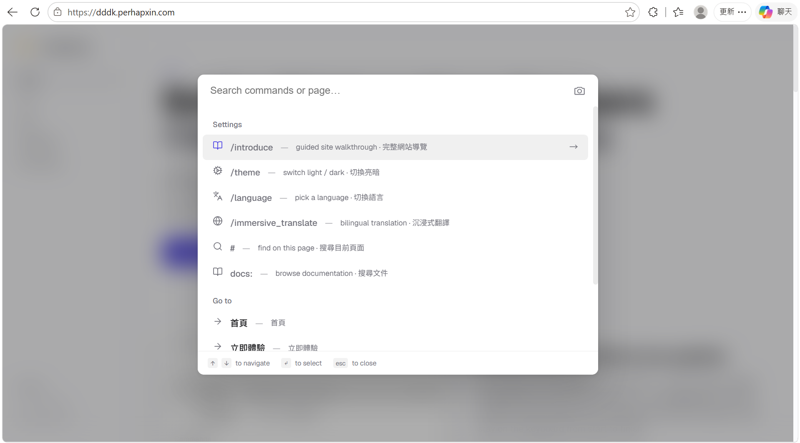
</td>
<td width="45%" valign="top">

- **Ctrl/⌘+K 打開**。註冊的指令跟 Ask AI 並排在同一張清單 — 切主題、切語言、開帳單、找客戶，全部用同一個入口處理。
- **前綴路由** — `/command`、`@entity`、`order:`、`#tag` — 給使用者一個方便的入口，不管當下卡在哪都能找得到答案。
- **三層客製**疊在一起：CSS 變數換主題、Skill SDK（Script / Prompt / Action / Surface / Panel）寫劇本、或直接把現有的 host 功能接成 palette item。
- **零內建指令** — palette 裡顯示什麼完全由你決定。SDK 提供基礎建設，詞彙交給你。

</td>
</tr>
</table>

---

## 02 · WebAgent — 直接操作頁面，不是側邊 chatbot

<table>
<tr>
<td width="55%" valign="top">
  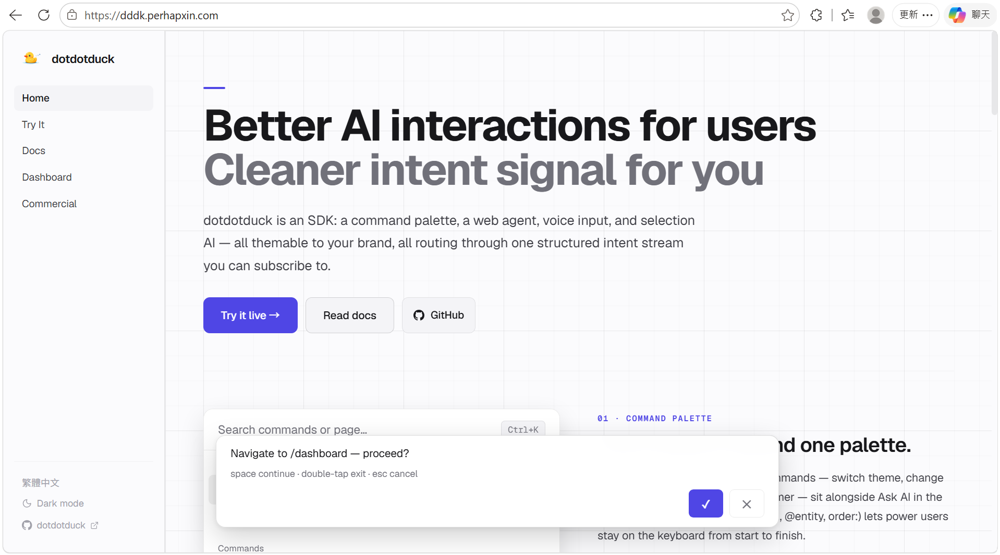
</td>
<td width="45%" valign="top">

- **DOM-grounded 自主迴圈**。讀目前可見的頁面，一次選一個 tool，跑之前先把步驟唸到字幕條上給使用者看。
- **12 個內建 action** — `navigate`、`click`、`fill_input`、`ask_user_choice` 等等。要加自己的也行，LLM 自己選用哪一個。
- **每一步都靠 Space 把關**。單擊接受 · 雙擊拒絕 · Esc 取消。使用者在事情發生**之前**就看得到它要做什麼。
- **不確定時主動問**。`ask_user_choice` 對應 2-4 個選項，`ask_user` 接收自由文字。不會偷偷做決定，也不會憑空猜。
- **自帶 key**。LLM 可走 OpenAI、Google AI Studio、或 server 端的 `ProxyProvider`；per-role routing 把便宜的模型留給後處理、把旗艦留給 agent 迴圈。STT 預設用瀏覽器內建的 Web Speech 零設定，要換 Whisper 或任何廠商就一行 `transcribe(audio)` callback。

</td>
</tr>
</table>

---

## 03 · Inline Agent — 反白文字，AI 不用離開輸入框

<table>
<tr>
<td width="55%" valign="top">
  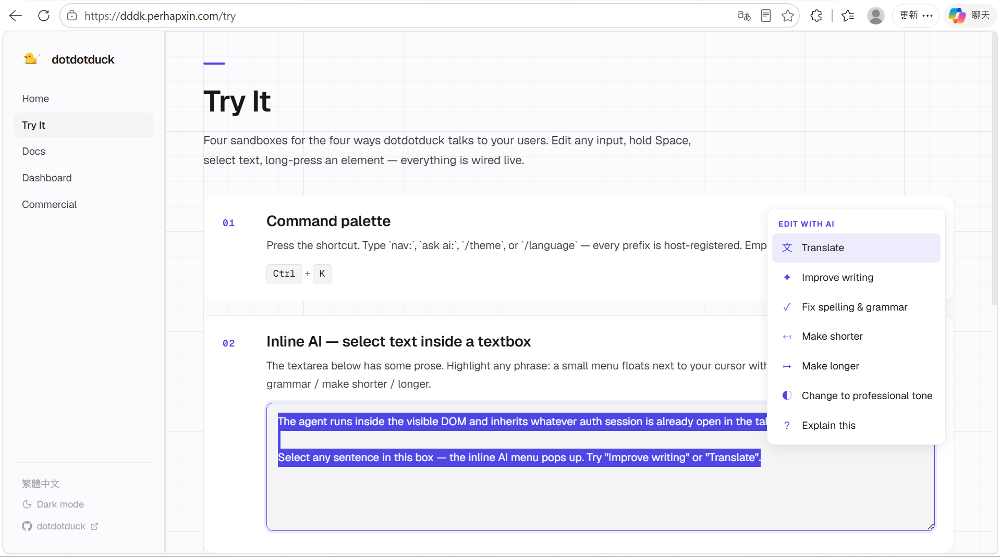
</td>
<td width="45%" valign="top">

- **反白任何文字**，只要在 `<input>` / `<textarea>` / `[contenteditable]` 裡都行，選取下方就會浮出小工具列。選一個 action，結果直接串流回填到原本反白的位置。
- **七個預設 action** — 翻譯、潤稿、修文法、縮短、延長、改成正式語氣、解釋。可以全部換掉、加自家的（`/translate-with-glossary`、`/rewrite-as-email`）。
- **雙欄 layout** 給編輯器類型的 host 用 — 一邊 `Format`、一邊 `AI`。也可以掛快捷鍵（例如 `Ctrl+Shift+R` 不開選單直接改寫）。

</td>
</tr>
</table>

---

## 04 · 直覺操作 — 把現有手勢轉成 context

四種把 context 餵進 dddk 的方式，沒有新的詞彙要學。

<table>
<tr>
<td width="55%" valign="top">
  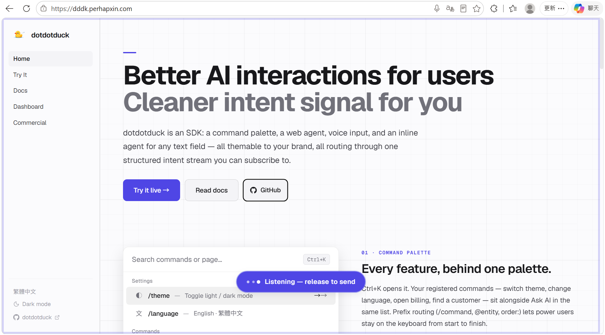
</td>
<td width="45%" valign="top">

**A · 長按 Space — 語音輸入**

- 焦點在輸入框內 → 轉錄回填到輸入框；其他地方 → 直接送進 agent。
- 可選 LLM 後處理 — 一次解決贅詞跟標點。
- **STT 可替換** — 預設用瀏覽器內建的 Web Speech（沒 SLA、Firefox 不支援）。一個 `VoiceConfig.transcribe` callback 就能換成 Whisper 或任何廠商。

</td>
</tr>
<tr>
<td width="55%" valign="top">
  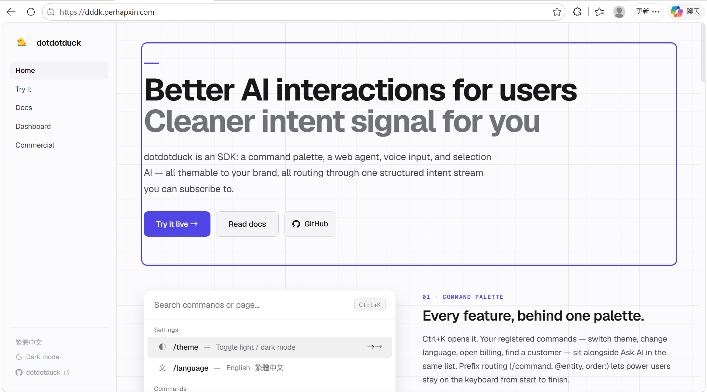
</td>
<td width="45%" valign="top">

**B · 長按任何元素 — Dwell**

- 長按頁面任何元素約 1 秒 → 框架釘住它。
- 下一次按 `Ctrl+K` 開 palette 時，這個元素就會帶進去當 context。
- 視覺類元素（圖表、圖片）順手附上**自動截圖**。

</td>
</tr>
<tr>
<td width="55%" valign="top">
  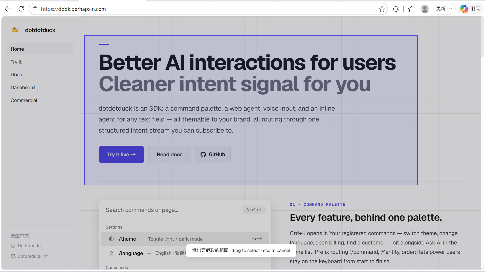
</td>
<td width="45%" valign="top">

**C · 拖框截圖**

- 點 palette 右側的相機 → 在頁面上拖一個矩形。
- 截到的區域會夾在下一次 Ask AI / agent 的 context 裡。
- 圖表、儀表板、地圖 — 直接給 AI 看，不必用文字描述。

</td>
</tr>
<tr>
<td width="55%" valign="top">
  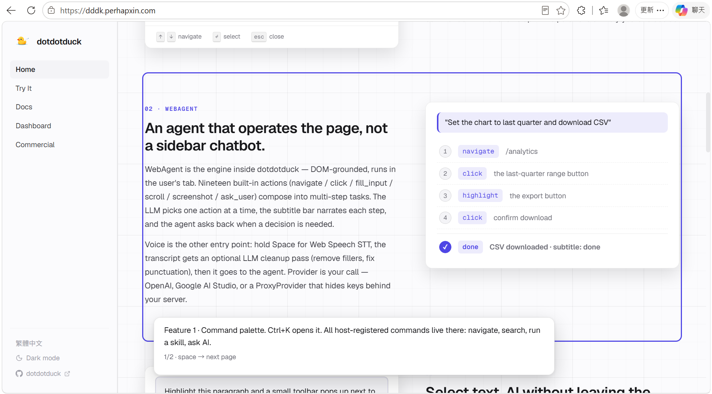
</td>
<td width="45%" valign="top">

**D · `/introduce` — 導覽**

- 宣告式 tour — 由 `page` + `subtitle` + `action(tools)` 步驟組成的清單。
- Space 前進 · Esc / 雙擊 Space 退出。使用者用自己的節奏看。
- onboarding 或 feature tour 寫一份，任何時候播 — palette 指令、proactive 提示、或程式直接呼叫都行。

</td>
</tr>
</table>

---

## 05 · 行動裝置 — FAB + 自家按鈕

<table>
<tr>
<td width="35%" valign="top" align="center">
  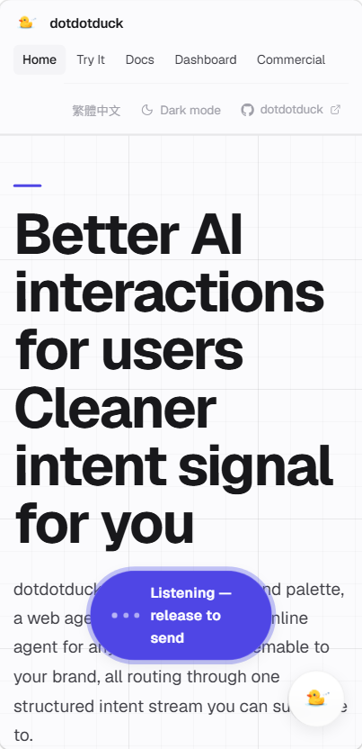
</td>
<td width="65%" valign="top">

- **浮動操作按鈕（FAB）**。手機 breakpoint 上自動出現 — 點一下開 palette、長按變語音對 agent 講話。
- **觸控手勢**。桌面用的 Space-hold / long-press / multi-choice 全部對應到觸控 — 點 → palette、長按 → 語音、按數字鍵 → 選項。
- **換你自家的按鈕**。FAB 可以換成 host 的任何元素，傳 selector 或 `HTMLElement`，dddk 把開啟 / 對話 handler 自動掛上去 — 按鈕想擺在 header、側欄、品牌 logo 都行。
- **響應式 chrome**。字幕條會自動避開螢幕鍵盤；640px 以下 palette 自動全寬；觸控目標符合 44×44 規範。

</td>
</tr>
</table>

---

## 06 · Proactive — 讀懂訊號、問對問題

<table>
<tr>
<td width="55%" valign="top">
  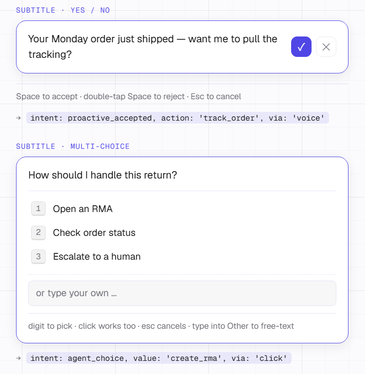
</td>
<td width="45%" valign="top">

- **Agent 訂閱頁面訊號** — scroll 深度、Dwell 時間、停留時長、上次互動 — 條件對上時，把一個提議浮到字幕條。
- **Yes / no 用 Space 解決**。單擊接受、雙擊拒絕。沒有 popup、不會 layout shift — 整段對話都在字幕條完成。
- **多選用 1-9 數字鍵**，最後一格永遠是 **Other** 接自由文字。選項有蓋到的話使用者不打字就解決，沒蓋到也還是能填。
- **每個回答都發一個有型別的 intent**（`agent_answered` 帶值、`confirm_action` 等），你可以直接量哪些有效。不是 big-data 撈魚 — 直接問、直接記。
- **客服場景開箱即用** — 訂單剛出貨 → 「要幫你查物流嗎？」；使用者停在退貨頁太久 → 列三個常見動作。

</td>
</tr>
</table>

---

## 07 · Intent stream — 每一個 yes / no 都是訊號，儀表板自然會浮現

<table>
<tr>
<td width="55%" valign="top">
  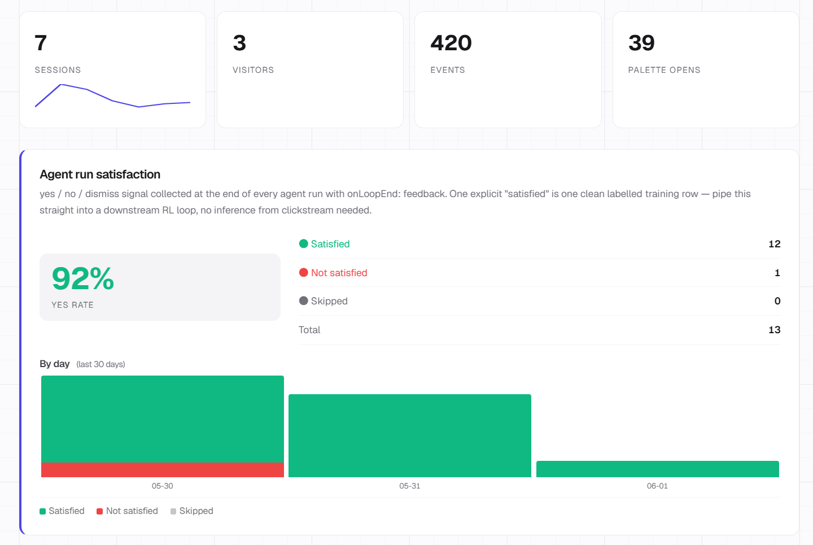
  <br /><br />
  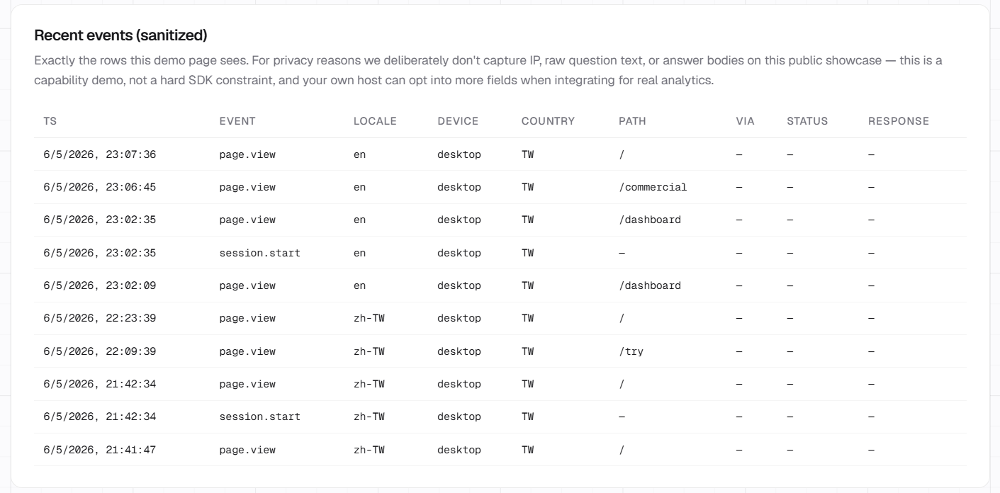
</td>
<td width="45%" valign="top">

- **每一次互動都發一個有型別的 event**。Palette 開啟、語音轉錄、agent 回答、接受 / 拒絕手勢、Dwell 選取、多選挑選、甚至每一個 LLM call 的串流效能 — 全部走同一條結構化訊號流。
- **Event 種類**：`palette_activated` · `voice_captured` · `agent_asked` / `agent_answered`（帶 `latencyMs`）· `agent_run_started` / `completed` / `stopped` · `agent_pause_decision` · `agent_llm_call`（TTFT、tokens/sec、model）· `confirm_action` · `selection_used` · `skill_started` / `finished` · `agent_feedback`。要加自家的也走同一個通道。
- **乾淨的行為訊號，不用在資料海裡撈魚**。你從使用者實際問了什麼、答了什麼學到他要什麼，不是從 clickstream 反推。
- **內建 dashboard route** 直接把訊號跑成圖表 — yes-rate 時間序列、按模型分組的 TTFT / tok-per-sec、agent run 完成率、熱門 palette 指令、地理分布 — 或在程式裡訂閱 stream 自己接 Mixpanel / Amplitude / 自家 BI。

</td>
</tr>
</table>

---

## 為什麼採用 — 八個實際劇本

1. **大部分的客服票，其實在頁面上就解得掉**。「我要怎麼 X」/「Y 在哪裡」/「查物流」/「換方案」 — 答案早就在你網站裡，差的是被找到。DOM-grounded agent 直接**操作頁面**就把這個 gap 接起來。在客服進到真人佇列之前，先處理掉好打的 70%。

2. **Proactive 提議的轉換率夠看**。盯著 scroll、Dwell、停留時長、上次互動，agent 就能在使用者想到之前主動問「要幫你查物流嗎？」/「要不要照你正在看的東西推薦一下？」。字幕條 yes / no 一鍵解決 — 物理上能做到的最低摩擦。同一個介面也吃得下 cross-sell 跟 upsell。

3. **Palette 是個 UI 介面，不是純文字列表**。每列的詳細區（以及 palette 內的 PanelSkill）可以 render 任何 **Pieces** 樹 — 圖表、表格、表單、迷你儀表板。Palette 變成真正的生產力介面，不只是 launcher：
   - **金融** — 在 palette 打 `AAPL`，旁邊跑出即時報價卡 + sparkline。
   - **客服** — 打一個問題，palette 直接顯示對應 FAQ 條目的格式化答案，不是給你一個連結再讓你點。
   - **工具型 SaaS** — 把工具（regex tester、JSON formatter、單位換算、內部查詢）全部塞進 palette，使用者完全不用切 tab。同樣的 `Ctrl+K`，每個產品有自己的動詞。

4. **長按勝過「截圖再描述」**。Dwell 讓使用者長按一個元素，agent 一個手勢就同時拿到 selector + 自動截圖 — 圖表、儀表板區、表格列、都行。使用者不用再中斷自己去截圖、貼進對話框、寫一段話解釋。意圖從手指直接流到 LLM。

5. **一個 palette 指令打破語言牆**。內建的 immersive translate 把當前頁面每一個段落雙語並排 render — 一個按鍵就把你英文-only 的文件 / KB / 產品文案變成中 / 日 / 韓 / 西語讀者看得懂的介面。每頁批次成幾個 LLM call（200 段的文章大概 7 個 call）。對跨境 SaaS、內容平台、或服務多區域的產品，roadmap 上就少一個翻譯工程專案。

6. **一個 SDK 取代縫六個廠商**。Palette + agent + inline AI + 語音 + Dwell + proactive + analytics + immersive translate 一次裝好。傳統作法是 Algolia 做搜尋、Intercom 做 chat、Mixpanel 做分析、Whisper 做語音，加上中間那些脆的膠水 code。dddk 一個 dependency、一套主題系統、一條 intent stream。

7. **Yes / no / 多選 = 免費的 RL 標籤**。每一個 Space-接受、雙擊-拒絕都是一筆乾淨、刻意的訊號 — 使用者真的想要什麼 vs 不想要什麼，本人說的、跟原始 prompt 一起記下來。不用再從 clickstream 雜訊反推。下一次要 fine-tune 或 eval 用的訓練集，順手就收完了。

8. **語音不只用在瀏覽器**。同一套 `Voice` + `voiceCleanup` 撐得起 IoT 面板、kiosk 終端、服務機台、銀髮 / 不想打字使用者的無障礙介面。所有有麥克風的裝置共用一個心智模型。

## 狀態 — 早期階段，評估前先看

dotdotduck 仍在積極開發中。能跑，但會有粗糙的邊角。先講幾件事：

- **要認真評估的話，請 clone repo**。內建的文件當地圖好用，但原始碼才是真相。`git clone https://github.com/PerhapxinLab/dotdotduck` 進你的專案目錄，搭配[線上文件](https://dddk.perhapxin.com/docs)一起讀 — 這是搞清楚實際實作的最佳路徑。
- **文件是 AI 撰寫的**。用 Claude Code 寫跟維護。慣例上盡量貼著程式碼，但如果看起來不對勁，grep repo 比相信文件可靠。
- **遇到 bug 或行為不清楚？** 到 [github.com/PerhapxinLab/dotdotduck/issues](https://github.com/PerhapxinLab/dotdotduck/issues) 開 issue — 一兩句話的描述就能影響 roadmap。

### 線上 demo 跑什麼（不綁定在 package 裡）

[dddk.perhapxin.com](https://dddk.perhapxin.com) 同時是 dotdotduck 的官方介紹頁，**也**是 package 的實際測試站 — 每次發版先上這個站、端對端壓過一輪，才會 tag。我們給自己的長期挑戰：用**還能用的最小模型**在每個角色把這個 demo 服務好，這樣別的團隊在成本壓力下採用 dddk 也照樣 work。下面列的模型選擇預期會持續換 — 小一點的 checkpoint 追上來就會換。

目前的 stack：

- **WebAgent** 迴圈、**InlineAgent**、語音轉錄後處理 → OpenAI `gpt-5.4-nano`
- **語音辨識** → 瀏覽器內建的 Web Speech API（SDK 預設；demo 沒問題、沒 SLA — 正式環境的 host 自己接 `transcribe` 走 Whisper / Deepgram 等等）

這些都不是 `@perhapxin/dddk` 寫死的。Package 本身只 ship LLM provider adapter（OpenAI / Google / proxy，加上任何 OpenAI-compatible 廠商透過 `baseURL` — 例如 DEepSeek、Qwen、OpenRouter）跟一個 `transcribe(audio)` 擴充點。Key、模型、ASR 廠商都自己帶 — SDK 不綁你。

## 文件

- **完整文件** → [dddk.perhapxin.com/docs](https://dddk.perhapxin.com/docs/v0.1.0/dddk/overview)
- **Agent**（DOM-grounded 迴圈 + InlineAgent + sitemap + Memory）→ [/dddk/agent](https://dddk.perhapxin.com/docs/v0.1.0/dddk/agent/overview)
- **LLM** provider + router + adapter registry → [/dddk/llm](https://dddk.perhapxin.com/docs/v0.1.0/dddk/llm/providers)
- **Skills** 系統 + evals → [/dddk/skills](https://dddk.perhapxin.com/docs/v0.1.0/dddk/skills/overview)
- **Modules**（voice / Dwell / inline / immersive translate / proactive / analytics）→ [/dddk/modules](https://dddk.perhapxin.com/docs/v0.1.0/dddk/modules/overview)
- **Toolbox**（search + recommend）→ [/dddk/toolbox](https://dddk.perhapxin.com/docs/v0.1.0/dddk/toolbox/overview)
- **Theming** → [/dddk/theming](https://dddk.perhapxin.com/docs/v0.1.0/dddk/theming)

## 安裝

```bash
pnpm add @perhapxin/dddk
# 或：npm i @perhapxin/dddk
```

```ts
import { DotDotDuck, OpenAIProvider } from '@perhapxin/dddk';
import '@perhapxin/dddk/styles.css';

const dddk = new DotDotDuck({
  llm: new OpenAIProvider({
    apiKey: import.meta.env.VITE_OPENAI_KEY,
    model: 'gpt-5.4-mini',
  }),
  siteName: 'YourSaaS',
  skills: [
    {
      id: 'introduce',
      type: 'script',
      name: 'Tour the app',
      steps: [
        { subtitle: '歡迎！', action: (t) => t.spotlight('.hero') },
        { subtitle: '這是價格區。', action: (t) => t.highlight('.pricing'), waitForUser: true },
      ],
    },
  ],
});

dddk.mount();
```

按 `Ctrl/⌘+K`、打 `/introduce`、看它跑。完整的[安裝指南](https://dddk.perhapxin.com/docs/v0.1.0/dddk/quickstart-frameworks)有 React / Vue / Svelte / Solid 的整合說明。

## 主題

所有視覺都讀 CSS 自訂變數 — `--dddk-bg`、`--dddk-accent`、`--dddk-radius`、`--dddk-font` 等等。在 `:root` 蓋掉，或裹在任何 wrapper 內 scope。

```css
:root {
  --dddk-accent: #6366f1;       /* 你的品牌色 */
  --dddk-radius: 10px;
  --dddk-font: 'Inter', system-ui, sans-serif;
}
```

暗色模式自動切：樹上任何位置設 `[data-theme="dark"]`，或者 `@media (prefers-color-scheme: dark)` — 哪個先 match 就用哪個。要做自家風格（sepia、高對比、品牌主題）就在新的 selector 下覆寫同樣那組變數。

## 授權

<table>
<tr>
<th width="50%" align="left">AGPL-3.0-or-later — 免費</th>
<th width="50%" align="left">商業 — 付費</th>
</tr>
<tr>
<td valign="top">

✓ 開源專案
<br />✓ 內部工具
<br />✓ 個人專案
<br />✓ 任何跟 AGPL 相容的場景
<br /><br />
拿去用、改、ship — 把你的修改也按 AGPL 釋出就好。

</td>
<td valign="top">

✓ 閉源產品
<br />✓ 商業 SaaS
<br />✓ 任何沒辦法滿足 AGPL network-copyleft 條款的場景
<br /><br />
完整條款看 [LICENSE](./LICENSE)，或透過 repo 聯絡維護者。

</td>
</tr>
</table>

---

<p align="center">Built by Perhapxin Team</p>
